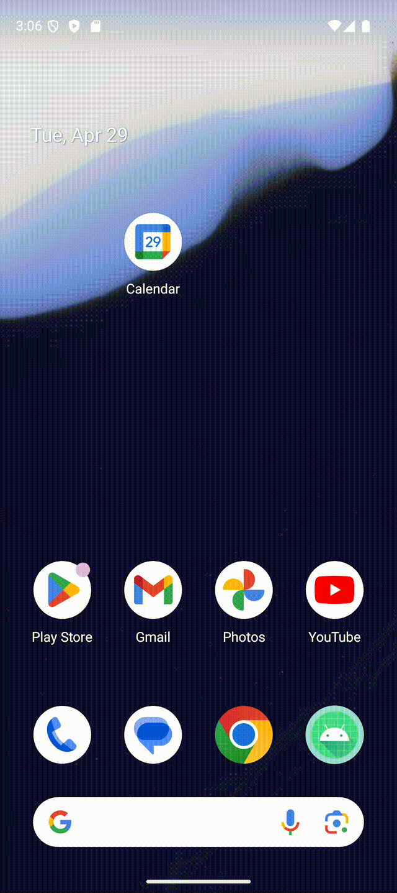
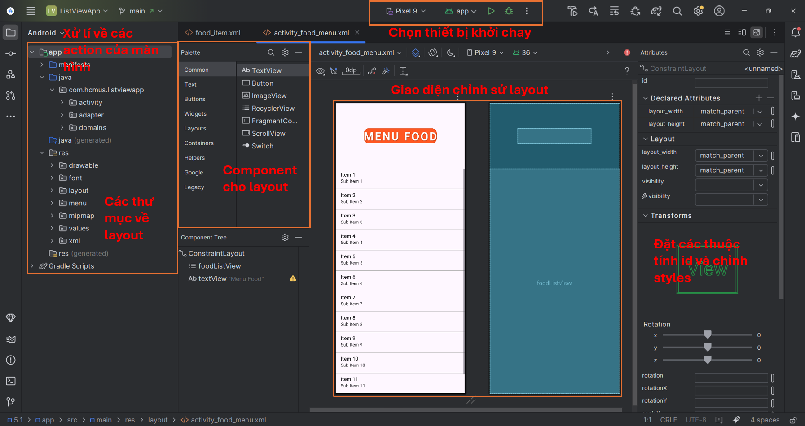
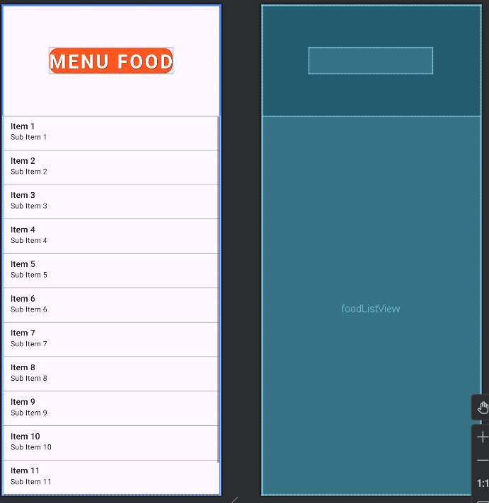
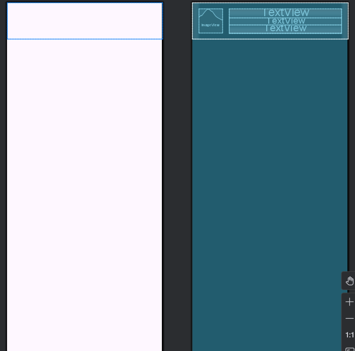
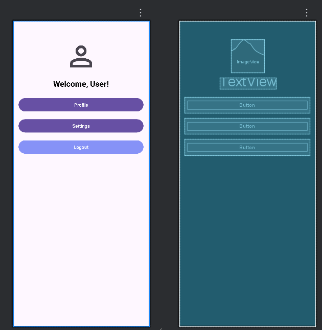
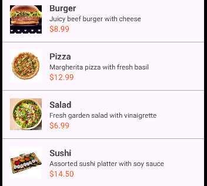

# 🍔 Android App: Ứng dụng ListView món ăn/trái cây

Ứng dụng này là một ví dụ về cách hiển thị danh sách món ăn hoặc trái cây bằng `ListView` trong Android.
Mỗi mục hiển thị hình ảnh, tên, và lượng calo.

---
## 🎬 Chương trình ứng dụng và kiểm thử
[5.1]


---
[5.2]


---
##  🎬 Xem bài 5.1 tại Youtube
[](https://youtube.com/shorts/dcgo6NvE0l4)

---
##  🎬 Xem bài 5.2 tại Youtube
[](https://youtube.com/shorts/Z_t--WyPowc)

---

## 🚀 1. Tạo Project mới trong Android Studio
Tạo một dự án mới trong **Android Studio**:


---

## 🏗️ 2. Chọn loại Activity
Chọn **Basic View Activity** để có giao diện cơ bản:


---

## ✏️ 3. Đặt tên project và chọn cấu hình Android
Nhập tên ứng dụng, package name, và chọn ngôn ngữ **Java/Kotlin**:


---

## 🖥️ 4. Màn hình chính trong Android Studio
Khi mở dự án, bạn sẽ thấy giao diện chính gồm **XML Layouts** và **MainActivity**:


---

## 🎨 5. Thiết kế giao diện (Layout)
## 🧱 Cấu trúc giao diện

- `activity_main.xml`: chứa ListView
- `list_item_fruit.xml`: layout từng item với ImageView và 2 TextView

## 🔧 Code chính

- `FoodItem.java`: class mô tả món ăn
- `FoodItemAdapter.java`: Adapter hiển thị list
- `MainActivity.java`: khởi tạo và hiển thị danh sách
### 🔹 Main Activity
Màn hình chính hiển thị danh sách các món ăn hoặc trái cây bằng `ListView`. Mỗi mục gồm hình ảnh, tên và lượng calo.  


---

### 🔹 list_item_fruit.xml
Giao diện của từng mục trong danh sách. Hiển thị một hình ảnh bên trái, tên món/trái cây ở giữa và lượng calo ở bên phải.  


---

### 🔹 Custom Adapter
Lớp `FoodItemAdapter` dùng để gán dữ liệu từ danh sách `FoodItem` vào các thành phần giao diện trong `list_item_fruit.xml`.  


### 🔹 Custom Adapter
Giao diện thực tế (5.1) 

---
## 🛠️ 7. Cách chạy ứng dụng

1. Clone repo này về máy:
   ```sh
   git clone https://github.com/Trung78z/AndroidPractice5AppListView.git
   ```
2. Mở **Android Studio** và import project.
3. Chạy ứng dụng trên **Emulator** hoặc **thiết bị thật**.


---

## 📩 8. Liên hệ
Nếu có thắc mắc hoặc góp ý, vui lòng liên hệ qua email: `trungpspy@gmail.com`.